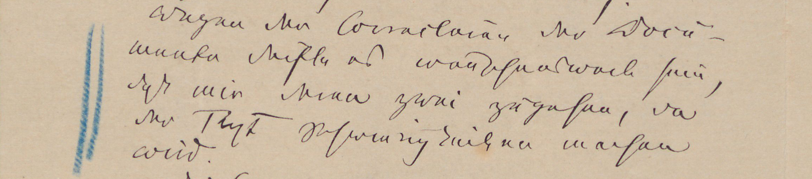
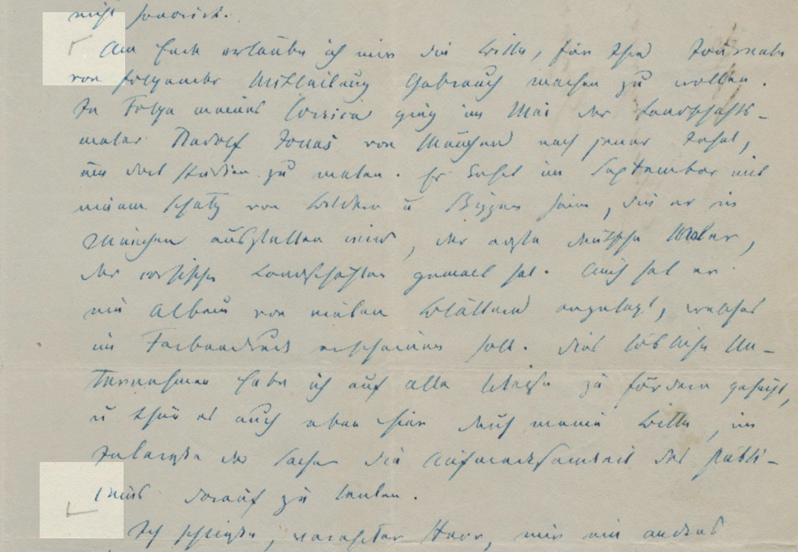
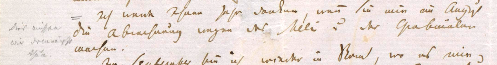
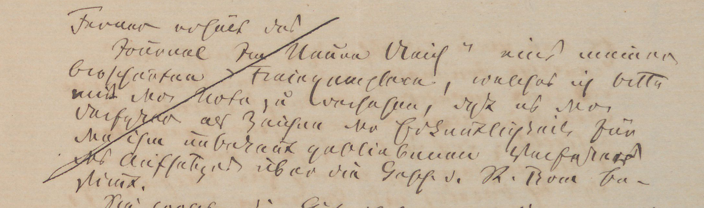
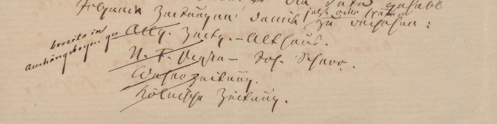

Kennzeichnungen und Anmerkungen im Brieftext sowie Marginalien des Empfängers werden an entsprechender Stelle dokumentiert.
Unterschieden werden Erledigungsvermerke mit und ohne Anmerkung sowie Anstreichungen mit und ohne Anmerkung des Empfängers, die mit dem Brief selbst und dem in ihm verhandelten Inhalt in unmittelbarem Zusammenhang steht.


<small>Abb. 1: Absatzanstreichung (Ferdinand Gregorovius an J. G. Cotta’sche Buchhandlung. Rom, 6. Februar 1874)</small>

```xml
<p>
    <add place="left" hand="#addressee">
        <metamark target="#seg-1" function="used" rendition="#mMM"/>
    </add>
    <seg xml:id="seg-1">Wegen der Correcturen der Documente dürfte es wünschenswert 
    sein, daß mir deren zwei zugehen, da der Text Schwierigkeiten machen wird.</seg>
</p>
```


<small>Abb. 2: Ferdinand Gregorovius an Heinrich Brockhaus. Genzano, 5. August 1856</small>

```xml
<p>
    <add place="left" hand="#addressee">
        <metamark target="#seg-1" function="used" rendition="#mMM"/>
    </add>
    <seg xml:id="seg-1">Am Ende erlaube ich mir die Bitte [...] 
    Aufmerksamkeit des Publicums darauf zu lenken.</seg>
</p>
```


<small>Abb. 3: Ferdinand Gregorovius an Eduard (?) Brockhaus. Florenz, 20. Juli 1858</small>

```xml
<p>
    <note place="left" hand="#addressee">
        <metamark target="#seg-1" function="used" rendition="#mMM"/>
        Dies müssen wir demnächst thun.
    </note>
    <seg xml:id="seg-1">Ich werde Ihnen sehr danken, wenn Sie mir im August 
    die Abrechnung wegen des Meli und der Grabmäler machen.</seg>
</p>
```


<small>Abb. 4: Erledigungsvermerk (Ferdinand Gregorovius an J. G. Cotta’sche Buchhandlung. Rom, 19. April 1874)</small>

```xml
<p>
    <add place="left" hand="#addressee">
        <metamark target="#seg-2" function="done"/>
    </add>
    <seg xml:id="seg-2">Journal [...] bestimmt.</seg>
</p>
```


<small>Abb. 5: Erledigungsvermerk mit Anmerkung (Ferdinand Gregorovius an J. G. Cotta’sche Buchhandlung. Rom, 19. April 1874)</small>

```xml
<list xml:id="list-1" rendition="#et">
    <item>
        <note place="left" hand="#addressee">
            <metamark target="#seg-4" function="done"/>
            bereits in Aushängebogen ges.
        </note>
        <seg xml:id="seg-4">
            <orgName key="ed_qq4_dbb_h2b">Allg<ex>emeine</ex> 
            Zeit<ex>un</ex>g</orgName> – 
            <persName key="ed_ms5_rq4_h2b">Althaus</persName>
        </seg>. 
    </item>
    [...]
</list>
```
