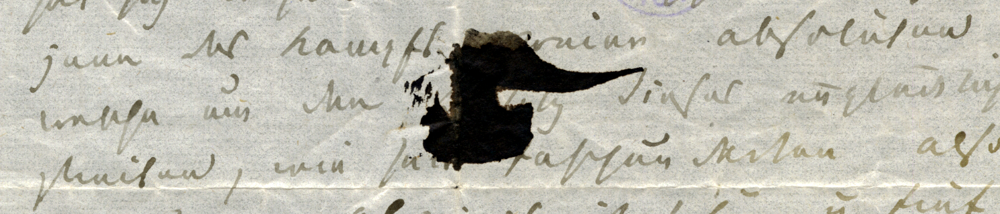
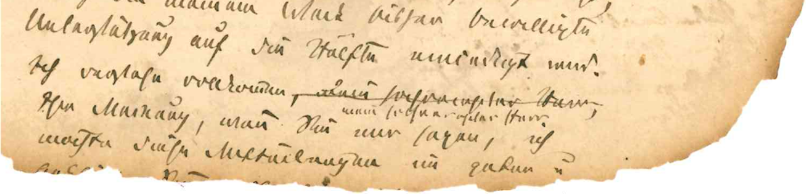
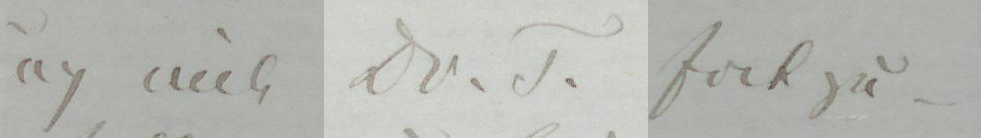
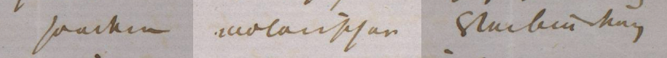
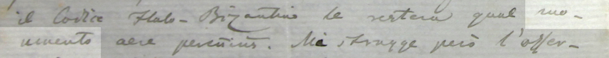
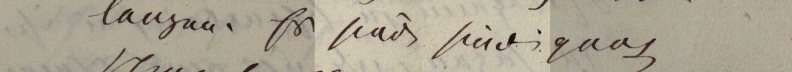
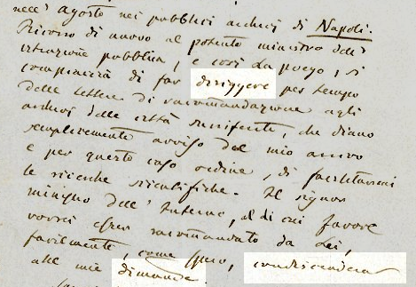

## Textverlust

Durch Beschädigung verlorene oder nicht entzifferbare Stellen werden ergänzt und die Wahrscheinlichkeit der Lesart dokumentiert. Nicht rekonstruierbare, beschädigte oder verlorene Textstellen werden entsprechend ausgezeichnet. In der [Überlieferung](../ueberlieferung) wird möglichst präzise über die Art der Beschädigung berichtet (z. B. Textverlust 1r auR durch Siegelausriss oder Tintenfleck) sowie bei größeren Lücken über den Umfang der verlorenen Textstelle. Auf längere zusammenhängende Fehlpassagen aufgrund des Verlustes ganzer Briefteile (z. B. Anfang, Schluss, mehrere Seiten) wird zudem in der [physischen Beschreibung](../ueberlieferung/#physische-beschreibung) hingewiesen.


<small>Abb. 1: Tintenfleck (Ferdinand Gregorovius an Moritz Hartmann. Rom, 7. Mai 1859)</small>

```xml
[...]
<unclear reason="covered" cert="high">z</unclear>weier 
absoluten Mächte gezogen, welche um den 
B<unclear reason="covered" cert="high">esi</unclear>tz 
dieses unglücklichen Landes streiten, wie 
se<unclear reason="covered" cert="high">it</unclear>
[...]
```

Ursache der Beschädigung oder des Textverlusts  | `@reason`
------------                                    | -------------
Bedeckung durch Überschreibungen, Tinte o .Ä.   | `"covered"`
unleserliche Schrift                            | `"illegible"`


<small>Abb. 2: Textverlust durch Brandschäden (Ferdinand Gregorovius an Hermann von Thile. Rom, nach dem 8. und vor dem 19. April 1866, Konzept)</small>

```xml
möchte diese Mitteilungen im guten u<ex>nd</ex>
<gap reason="lost" unit="lines" quantity="1"/>
```

## Auflösung von Abkürzungen

Abkürzungen werden unter Wegfall von Abkürzungspunkten kursiv aufgelöst. Das gilt in der Regel für abgekürzte Personen-, Orts- und Monatsnamen wie auch Buchtitel u. ä. Nicht ergänzt werden allgemein übliche Abkürzungen wie *z. B.*, *Dr.* oder *etc.*


<small>Abb. 3: Ferdinand Gregorovius an die J. G. Cotta’sche Buchhandlung. Rom, 2. Juni 1872</small>

```xml
<hi rendition="#aq">Dr. T<ex>öpelmann</ex></hi>
```

## Korrekturen

Offensichtliche Schreibversehen (s. Abb. 4 und 5), wie z. B. ausgelassene oder doppelt geschriebene Worte (Abb. 6) werden korrigiert und textkritisch dokumentiert.
Dies gilt insbesondere für die italienischen Briefe von Gregorovius, die über die Jahre seinen Spracherwerb des Italienischen nachzeichnen.


<small>Abb. 4: Ferdinand Gregorovius an Eduard (?) Brockhaus. Florenz, 20. Juli 1858</small>

```xml
<choice>
    <sic>molarischer</sic>
    <corr cert="high">moralischer</corr>
</choice>
```



<small>Abb. 5: Ferdinand Gregorovius an Sebastiano Kalefati. Rom, 23. Oktober 1859</small>

```xml
<choice>
    <orig>moumento</orig>
    <corr cert="high">monumento</corr>
</choice>
```


<small>Abb. 6: Ferdinand Gregorovius an Ottilie Elgnowski. Rom, 1. April 1871</small>


```xml
<choice>
    <sic>sind</sic>
    <corr type="deleted"/>
</choice>
```

Nur Irrtümer hinsichtlich der Orthographie, die inhaltlich und/oder grammatisch missverständlich sind (z. B. *a* statt *ha*), werden ergänzt und als Herausgebereingriff gekennzeichnet.
Irrtümer hinsichtlich Grammatik und Syntax oder auch historische Wortformen (s. Abb. 7) werden allenfalls in den Sacherläuterungen dokumentiert.
Inkonsequenzen bzw. wechselnde Schreibweisen, auch bei Eigennamen, werden beibehalten.
Dass die Herausgeberentscheidung, ob ein Versehen vorliegt oder ob Gregorovius tatsächlich so schreiben wollte, nicht in jedem Fall sicher zu treffen ist, versteht sich.


<br/><small>Abb. 7: Ferdinand Gregorovius an Michele Amari. Rom, 6. Juni 1864</small>
