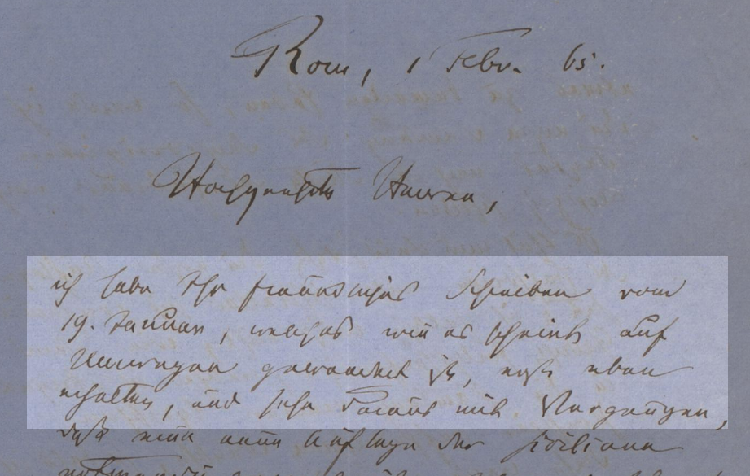
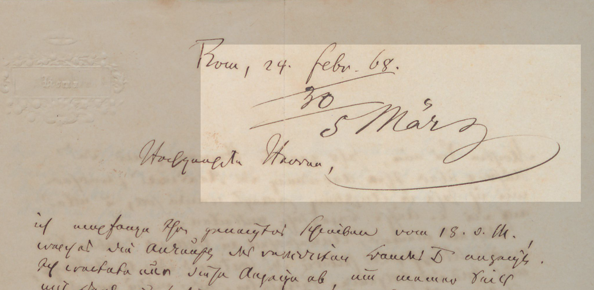
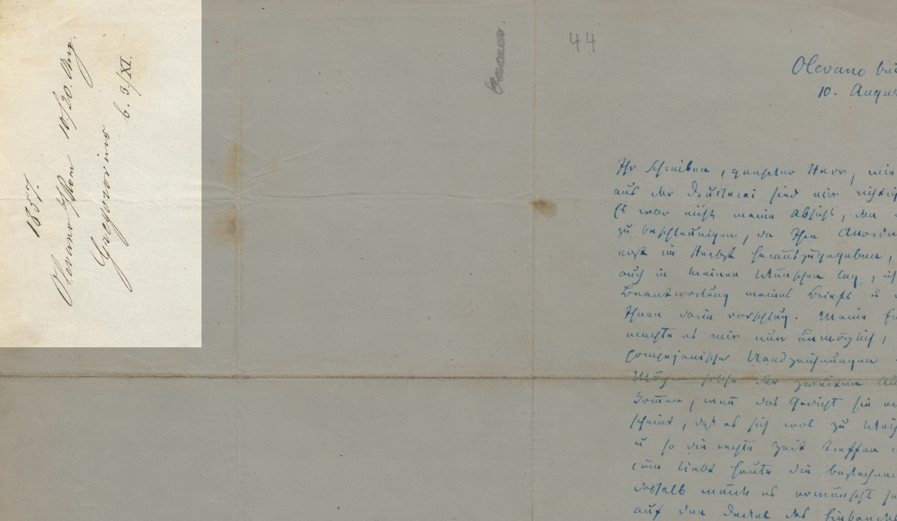

Der Korrespondenzkontext wird, nur soweit zweifelsfrei feststellbar, als „Vorangehender Brief“ und „Nachfolgender Brief“ rekonstruiert: Sind die Gegenbriefe überliefert, wird das Datum, der Aufbewahrungsort und/oder der zuverlässigste Textzeuge angegeben. 
Bei erschlossenen Briefen wird das Schreibdatum aus den edierten Briefen selbst (Abb. 1) oder aus Bearbeitungsvermerken auf den Gregorovius-Briefen (Abb. 2 und 3) rekonstruiert.


<small>Abb. 1: Ferdinand Gregorovius an Eduard und Heinrich Brockhaus. Rom, 1. Februar 1865</small>


<small>Abb. 2: Ferdinand Gregorovius an die J. G. Cotta’sche Buchhandlung. Rom, 24. Februar 1868</small>


<small>Abb. 3: Ferdinand Gregorovius an Heinrich Brockhaus. Olevano, 10. August 1857</small>

```xml
<correspContext>
    <ref type="prev"></ref>
    <ref type="next"></ref>
</correspContext>
```
