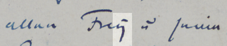
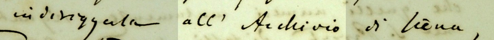
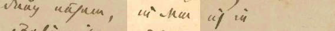

Spezifika der deutschen Schrift wie die Geminationsstriche sind durchgehend aufgelöst. Die Wiedergabe von Trenn- und Bindestrichen, Auslassungspunkten, Apostrophen und Anführungszeichen werden einheitlich wiedergegeben. Stillschweigend normalisiert werden das *ȳ* oder *ÿ* der Kurrentschrift als *y* (s. Abb. 1) sowie Verschleifungen. Getrennt- und Zusammenschreibungen sind bei Gregorovius nicht immer eindeutig unterscheidbar; gelegentlich muss nach seiner Schreibgewohnheit entschieden werden (s. Abb. 2 und 3).

 <small>Abb. 1: Ferdinand Gregorovius an Theodor Heyse. Rom, 6. Januar 1856</small>

<small>Abb. 2: Ferdinand Gregorovius an Cesare Guasti. Siena, 4. Oktober 1863</small>

 <small>Abb. 3: Ferdinand Gregorovius an Hermann von Thile. Rom, nach dem 8. und vor dem 19. April 1866</small>
