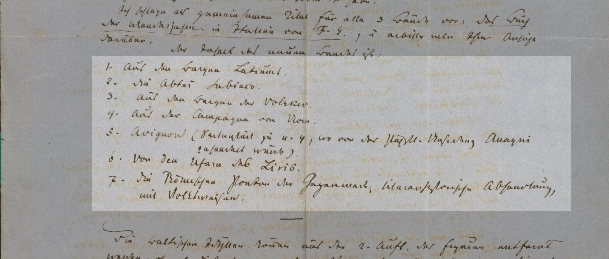

Die Gliederung des Textes folgt dem zugrunde gelegten Textzeugen. Dabei wird die graphische Gestalt der jeweiligen Briefe nicht imitativ, sondern strukturell nachgebildet. Entsprechendes gilt für die zeilengetreue Wiedergabe von Abfassungsort, Abfassungsdatum, Anrede, [Grußformel](#gruformel) und Unterschrift. 
Die Wiedergabe des fortlaufenden Textes nimmt auf den Zeilenfall keine Rücksicht,[^1] Folio- und Seitenwechsel werden verzeichnet.
Devotionsabstände bleiben unberücksichtigt.
Zeichnungen werden möglichst bildgetreu übernommen, graphisch strukturierter Text, z. B. in Versform, als [Liste](#liste) oder als [vorgedruckter Text](#vorgedruckter-text), wird nachgestaltet.

Bei Gemeinschaftsbriefen wird die Verfasserschaft der jeweiligen Textpassagen zu deren Beginn kenntlich gemacht.


### Schreibakt

```xml
<div type="writingSession" n="1">
    [...]
</div>
```

### Datumszeile

```xml
<dateline>
   Rom, den 17. September 1855
</dateline>
```

### Anrede

```xml
<salute>Mein verehrter Herr,</salute>
```

### Grußformel

Kommt in `<opener>` sowie `<closer>` vor, kann mit `@rendition` spezifiziert werden

```xml
<salute>
</salute>
```

```xml
<salute xml:id="s1" next="#s2">Coi sentimenti di profonda stima, mi creda, caro cavaliere, di cuore</salute>
<salute xml:id="s2" prev="#s1" rendition="#right">il suo devoto servito</salute>
```

### Unterschrift

```xml
<signed>
</signed>
```

### Postskriptum

```xml tab="Gregorovius-Schema"
<note type="postscriptum">
</note>
```

```xml tab="DTABf"
<postscriptum>
</postscriptum>
```

### Liste

```xml
<p>Der Inhalt des neuen Bandes ist:
    <list>
        <item><label>1.</label>Aus den Bergen Latiums.</item>
        <item><label>2.</label>Die Abtei Subiaco.</item>
        <item><label>3.</label>Aus den Bergen der Volsker.</item>
        [...]
    </list>
</p>
```


<small>Abb. 1: Ferdinand Gregorovius an Heinrich Brockhaus. Rom, 10. März 1863</small>


### Vorgedruckter Text

```xml
<p rendition="#c #mPrint">Ferdinand Gregorovius</p>
```


<small>Abb. 2: Ferdinand Gregorovius an Berthold Auerbach. München, 6. November 1881</small>

### Textausrichtung

```xml
<p rendition="#c">
    ma qui la: morta poesia risurga,<lb/>
    o sante Muse, poi che vostro sono,<lb/>
    e qui Calliope a alquanto surga.<lb/>
</p>
```

### Folio- und Seitenwechsel

Bei handschriftlicher Überlieferung wird zu Beginn der Seite die Folioangabe, bei Drucken wird analog des Textzeugen die Seitenzahl ausgezeichnet.

```xml
<pb n="1r"/>
```

```xml
<pb n="213"/>
```

### Versetzte Fortsetzung des Brieftextes

Absätze, die nach Erreichen des Blattendes gedreht am Rand fortgesetzt werden, werden entsprechend gekennzeichnet.

```xml
<p xml:id="p2" next="#p3">Il nuovo impegno che state per prendere sulle spalle, almeno vi aumenterà i mezzi da vivere [...]</p>
<p xml:id="p3" prev="#p2" place="left" rendition="#rotate90" next="#p4">a mia morte, non importa. Sta scritto nel Pindaro [...] communica-</p>
<p xml:id="p4" prev="#p3" place="mTop" rendition="#rotate180">zione, che non sia venuta alcuna lettera per me à Sorrento, [...] il vostro</p>
<closer>
    <signed rendition="#right">G.</signed>
</closer>
```


<small>Abb. 3: Ferdinand Gregorovius an Tommaso Gar. Rom, 31. Oktober 1864</small>

### Schriftartwechsel

Der unter historischem Gesichtspunkt als relevant erachtete Wechsel zwischen deutscher und lateinischer Schrift bzw. zwischen Fraktur und Antiqua wird so weit wie möglich konserviert. Wenn ein ganzer Brief in lateinischer Schrift verfasst ist, wie bei den italienischen Briefen regelmäßig, wird er in Normalschrift wiedergegeben.
Allerdings nähern sich bestimmte Buchstaben in den deutschsprachigen Briefen von Gregorovius grundsätzlich der lateinischen Schrift (wie *a* oder *r*), so dass die Unterscheidung von lateinischer und Kurrentschrift im Einzelfall nicht immer zweifelsfrei zu treffen ist.

```xml
<hi rendition="#aq">Euphorion</hi>
```

### Sprachwechsel

Fremdsprachige Textabschnitte, die von der Sprache des Briefes abweichen, werden als solche ausgezeichnet.

```xml
<foreign xml:lang="spa">por la vida di Dios</foreign>
```

[^1]: Dagegen wird [bei Versen](#textausrichtung) der Zeilenfall entsprechend der Handschrift abgebildet.
