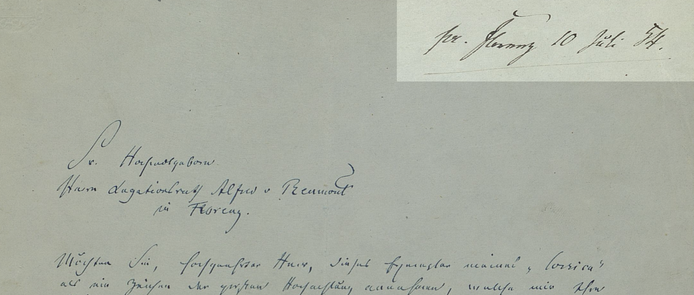
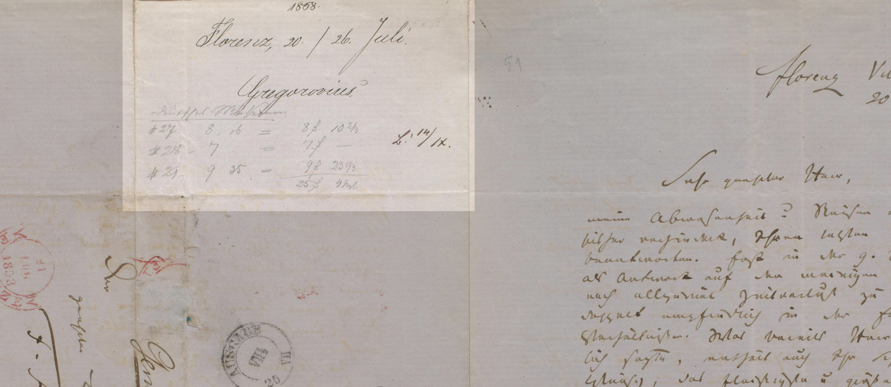

## Textgrundlage

Textgrundlage ist die Originalhandschrift (H), die ohne besondere Umstände abgeschickt und empfangen wurde, weitere Überlieferungsträger werden vermerkt (z. B. Konzept, Abschrift, Druck). 
Fehlt die Originalhandschrift, treten Abschrift von fremder Hand (h), Entwurf (K) oder Druck (D) an ihre Stelle; dabei dient der wahrscheinlich zuverlässigste Textzeuge als Editionsvorlage. 
In verschiedenen Textzeugen überlieferte, mit hoher Wahrscheinlichkeit authentische, unterschiedliche Abschnitte eines Briefes (z. B. im Falle einer unvollständigen Originalhandschrift und weiterführenden Abschrift) werden zusammenhängend im Textteil wiedergegeben und ggf. entsprechend erläutert.

## Physische Beschreibung

Zu den Handschriften folgen jeweils Informationen über Aufbewahrungsort, Signatur, Umfang und Format (letzteres in der Regel als 8°, 4°).
Billetts, Visitenkarten und Postkarten werden ohne Formatangabe so verzeichnet.
Es wird der Gesamtumfang des Briefes (Angabe von Blattzahl und -faltung: Doppelblatt und Blatt) und der Umfang der Beschriftung (Seitenzahl) auf dem Textträger verzeichnet.
Spezifische Angaben zur Beschaffenheit des Textträgers, zu Papierqualität, Wasserzeichen, Schreibmaterial, Siegelung, Beschädigungen oder Ausrissen, erfolgen nur, wenn sie für die Textkonstitution, die Datierung oder die inhaltliche Erschließung des Briefes von Bedeutung sind.
Adressen und eigenhändige Frankierungsvermerke werden nicht als Teil der brieflichen Mitteilung verstanden, aber unter Blattangabe buchstabengetreu sowie unter Berücksichtigung des Zeilenfalls (Schrägstrich) wiedergegeben; Poststempel, Postvermerke und Siegelung (mit Siegel, mit Siegelspuren) werden allenfalls normiert.
Empfangs- oder Beantwortungsvermerke werden diplomatisch getreu verzeichnet.


<small>Abb. 1: *1 Bl., 4°, 1 S. – 1v aoR, Empfängervermerk: pr. Florenz 10 Juli 54.* (Ferdinand Gregorovius an Alfred Reumont. Rom, 19. Juni 1854)</small>


<small>Abb. 2: *1 Dbl., 4°, 1 S. – 2v alR, Blatt um 90° gedreht, Adr.: Der sehr geehrten Redaction / der „Blätter für literarische Unterhaltung“ / zu / fran[co] / Leipzig. / Germania. – 2v Siegel, Poststempel – 2v aoR Eingangs- und Beantwortungsvermerk: 1854. / Rom, 20/28. Juni. / Gregorovius. / B. 7/XII.* (Ferdinand Gregorovius an die Redaktion der Blätter für literarische Unterhaltung. Rom, 20. Juni 1854)</small>

In der Überlieferung werden der jeweilige Textzeuge bzw. die jeweiligen Textzeugen durch Angabe der entsprechenden Aufbewahrungsorte, Sammlungen, ggf. Signaturen und/oder ordnende Archivvermerke[^1] sowie Besitzer, bei Drucken die bibliographischen Nachweise genannt.
Bei Abschriften werden nach Möglichkeit die Textgrundlage und der Schreiber benannt (z. B. *GStA Berlin, NL Kampf, Karton 82, Mappe 5, Alfred Löckle nach H*).
Die Verzeichnung mehrerer Textzeugen geschieht in chronologischer Reihe unter Angabe der Textgrundlage, ggf. unter Angabe der Zuverlässigkeit des jeweiligen Textzeugen (z. B. gekürzt, ungenau).

Notizen der Empfänger, die nicht zum Brieftext gehören, deren inhaltliche Bedeutung im Zusammenhang mit der Korrespondenz aber relevant oder nicht auszuschließen ist, werden [an der entsprechenden Stelle im Brieftext](empfaengervermerke.md) wiedergegeben.
Für umfangreicheren Text (wie z. B. Verlagsberechnungen, siehe Abb. 3) steht ein summarischer Hinweis in den Metadaten.


<small>Abb. 3:  Ferdinand Gregorovius an Eduard Brockhaus. Rom, 20. Juli 1858</small>

```xml
<msDesc>
   <msIdentifier>
      <repository/><collection/><idno/>
   </msIdentifier>
   <physDesc><p/></physDesc>
</msDesc>
```

[^1]: Archivvermerke werden grundsätzlich nur dann aufgenommen, wenn sie zur Auffindung am jetzigen Aufbewahrungsort relevant sind.
