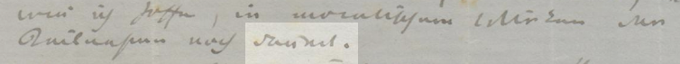

Bei unsicheren Lesungen hinsichtlich Groß-/Klein-, Getrennt-/Zusammenschreibung, Verschleifungen und dgl. wird von Fall zu Fall entschieden, soweit möglich nach den Schreibgewohnheiten des Verfassers: Personalpronomina in den persönlichen Briefen (*Dir*, *Deine*, *Dich*) werden analog den formellen Briefen von Gregorovius groß geschrieben. Nicht eindeutige Textstellen werden entsprechend gekennzeichnet (Abb. 1).


<small>Abb. 1: Ferdinand Gregorovius an Eduard Brockhaus. Rom, 10. Dezember 1859</small>

```xml
wie ich hoffe, in moralischem Wirken der Teilnahme noch 
<unclear reason="illegible" cert="high">dräuet</unclear>.
```