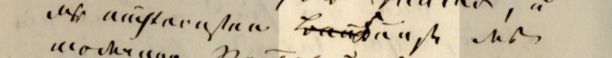
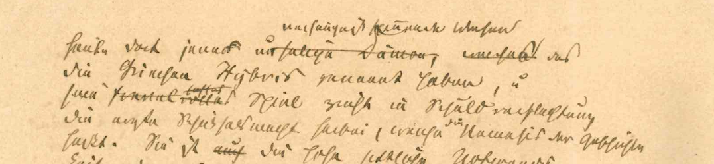
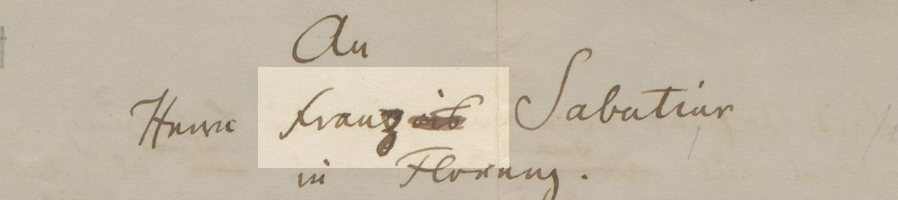

Ediert wird der Brieftext letzter Hand, doch werden inhaltlich relevante Varianten mitgeteilt. Dies gilt naturgemäß insbesondere für Konzepte (s. Abb. 2).


<small>Abb. 1: Tilgung und Überschreibung (Ferdinand Gregorovius an Raffaele Mariano. Rom, 7. Juni 1876)</small>

```xml
<del rendition="#s">Bau</del>
<subst>
    <del rendition="#ow">k</del>
    <add place="intralinear">K</add>
</subst>unst
```


<small>Abb. 2: Tilgungen und Hinzufügungen (Ferdinand Gregorovius an Hermann von Thile. Rom, nach dem 8. und vor dem 19. April 1866, Konzept)</small>

```xml
heute dort jene
<subst>
    <del rendition="#s">r</del>
    <add place="across">s</add>
</subst> 
<del rendition="#s">unselige Dämon, welches</del>
<add place="superlinear"> verhängniß spinnende Wesen </add>
das die Griechen Hybris genannt haben, u<ex>nd</ex> sein 
<del rendition="#s">fanal</del>
<del rendition="#s">volles</del>
<del rendition="#s"><add place="superlinear">haftes</add></del> 
Spiel zieht in Schuldverflechtung die erste Schicksalsmacht herbei, welche 
<add place="superlinear">die</add> Nemesis 
<add place="intralinear">der Geschichte</add> heißt.
```



<small>Abb. 3: Ersetzung durch Überschreibung (Ferdinand Gregorovius, Manuskript der Widmung für François Sabatier in Florenz. Rom, August 1860; Beilage zum Brief von Ferdinand Gregorovius an Heinrich Brockhaus. Rom, 1. Oktober 1860)</small>

```xml
Fran
<subst>
    <del rendition="#ow">çois</del>
    <add place="across">z</add> 
</subst> 
```